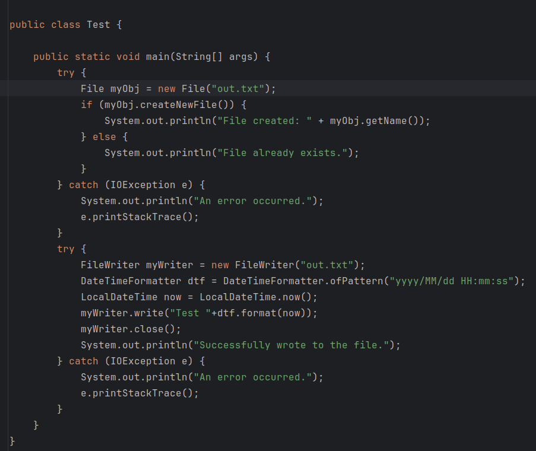
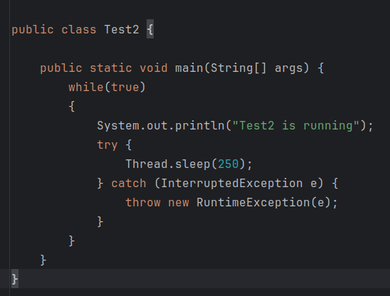
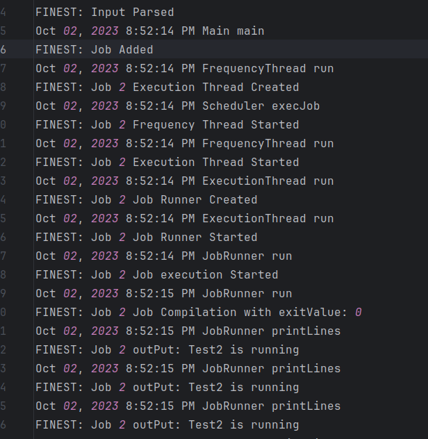
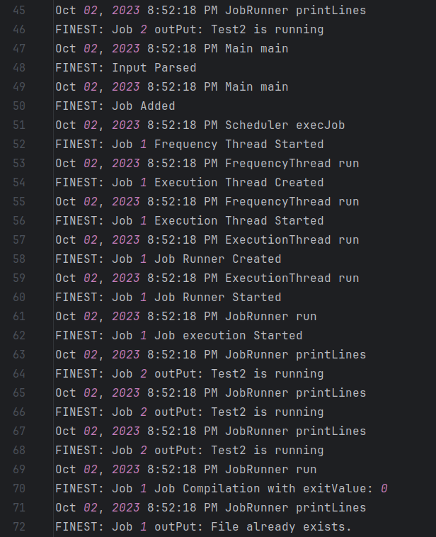
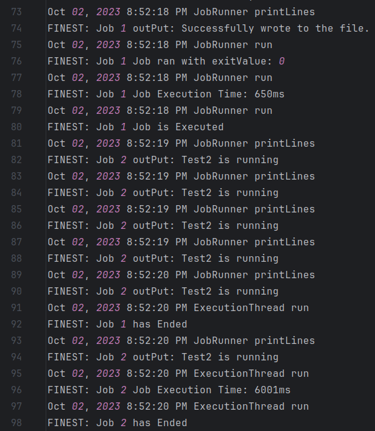

# Cron-Scheduler
This is an in-process cron scheduler that accepts a job and executes it periodically.


# How it works
- Takes from user the following:
  - A single run expected interval, e.g. 30m.
  - Scheduling frequency, e.g. 1hr for a job that should run every one hour.
  - The job implementation, e.g. a function.
  - A unique job identifier.
- Parse and validate the input.
- Pass the job data to the Scheduler.
- The Scheduler assigns a Thread to run the job periodically.
- The Frequency Thread assigns a Thread for job execution.
- The Execution Thread assigns a Thread to run the job and stops the job if it passes its expected execution time.

# Components
### The Job
- A .java file that has a main method and is located in the jobs directory.
### InputParser
- Validate the input using Regular expressions and Converts the expected execution time and the frequency time to milliseconds.
- Supported input for intervals: (Nh, Nhr, Nm, Nmin, Ns, Nsec, NhrNmin, NhrNminNsec, ...) where N is any number of digits.
- Supported input for job path: (jobs/[filename].java).
- Supported input for jobId: any string value.
### Scheduler
- Manage the execution of all jobs by assigning a thread for each job.
- Saving this Thread in a key-value map (jobId - Thread) to be able to kill a specific job execution using the jobId.
### Frequency Thread
- Creates the Execution thread, run it and then sleeps the interval time then creates another execution thread and run it and so on.
- The execution thread should have finished before the frequency thread wakes as it is assumed the execution time will be shorter than the frequency time.
### Execution Thread
- Creates the JobRunner thread, run it and then sleeps the interval time then checks if the job is still running if so it stops the job execution.
- Calculates execution time of job.
- No job is allowed to run for more than the execution time assigned by the user because if any job hangs that will be waste of resources.
### JobRunner
- It compiles the java file and then run it through terminal commands.
- The output of the job (if it has console prints) is logged in the log file

# Example Usage 
##### The jobs meant to run:
- Job 1

- Job 2


#### Enter the following input
```bash
6sec
1min30sec
jobs/Test2.java
2
```
#### Job 2 is running for 6 seconds every 1 and a half minutes.
#### Then enter the following input
```bash
2sec
1min
jobs/Test.java
1
```
#### Job 1 is running for 2 seconds every 1 minute.
#### Both jobs are running concurrently as shown in the log file.



#### The output of job 1 is shown in out.txt file

# Future Improvemnts
- Support more job types not only restricted to java files.
- Make the app listen on some port for requests rather than taking input from command line.
- Support jobs from different locations not only in jobs directory.
- Support user be able to kill a job while its execution.
- A more User friendly interface (GUI).